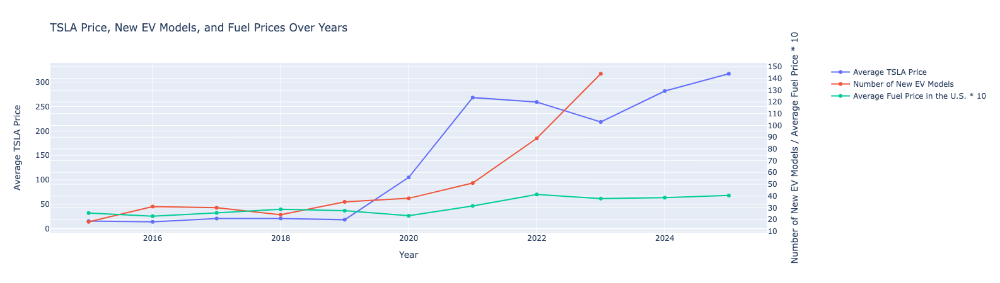
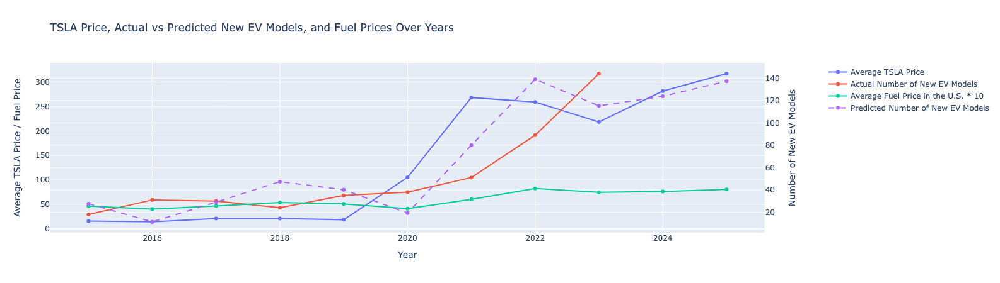

# EV Sales Prediction Project

This project collects and processes data related to Tesla stock prices and vehicle information for EV sales prediction analysis.

## Results
[Click here to view the Final Project Report (Google Slides)](https://docs.google.com/presentation/d/1lGaHgpP3FbwZHdyZJ207GX1rNtI-e0vKOdg9Ds_K_uo/edit?usp=sharing)

*Figure 1: Final analysis of EV sales trends and predictions*

*Figure 2: Detailed breakdown of market factors*

## Features

### Tesla Stock Data Collection
- Web scraping of Tesla historical stock data from Yahoo Finance
- Local HTML parsing of Tesla stock data
- Removes stock split entries and volume data
- Outputs processed data to CSV format

### Vehicle Data Processing
- Processes vehicle dataset with focus on EV-related information
- Filters for vehicles from year 2000 onwards
- Excludes hybrid, plug-in hybrid, and diesel vehicles
- Calculates average metrics for similar models
- Includes various vehicle metrics (MPG, fuel costs, electricity consumption)

## Data Sources
- Tesla stock data: Yahoo Finance
- Vehicle data: Local CSV file containing comprehensive vehicle information

## Output Files
- `data/processed/TSLA.csv`: Processed Tesla stock data
- `data/processed/updatedVehicles.csv`: Processed vehicle data
- `data/processed/FinalGraph.png`: Final analysis visualization
- `data/processed/newplot.png`: Detailed market analysis plot

## Dependencies
- pandas: Data manipulation and analysis
- beautifulsoup4: HTML parsing
- requests: HTTP requests for web scraping